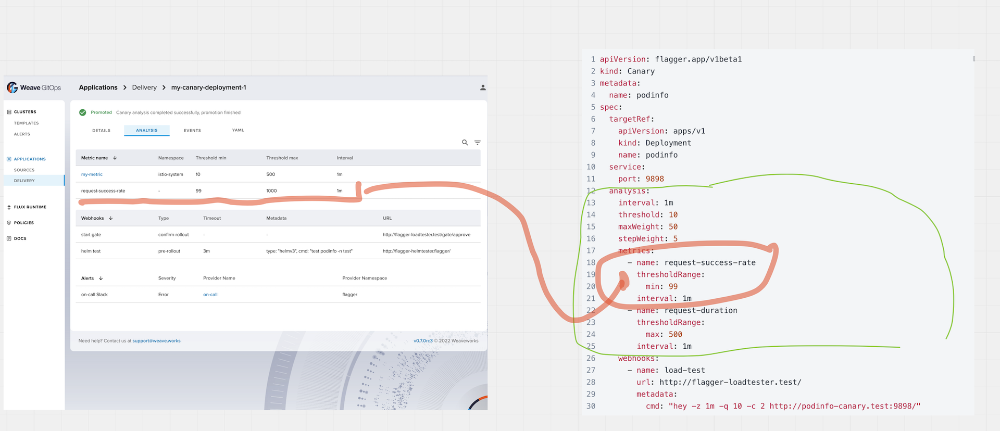

# Canary Analysis - Canary Metrics Design Proposal

This document outlines a proposed design to extend gitops enterprise progressive delivery domain with 
canary analysis capabilities. It will be using analysis of metrics as example.

## Problem statement 

As wget user doing progressive delivery for my applications, I am not able to understand via the enterprise experience 
the canary analysis section: 
- reducing the user levels of confidence by not having it visible to 
- decreasing its experience by having to use other tooling to get that information 

To address this gap the [canary analysis epic](https://github.com/weaveworks/weave-gitops-enterprise/issues/842) has been 
created and this document addresses the design for the first of the analysis tab sections: metrics.

the user journeys considered are:

- as wge user, I want to have an **overview** understanding of the metrics used for an application canary analisys.  
- as wge user, I want to have a **detailed** understanding of the metrics used for an application canary analisys.

## Scope 
**In scope** 
  - design backend apis for canary analysis metrics.
**Out of scope**
  - other sections of the analysis experienc like webhooks and alerts. It will be covered by other issues.  
  - frontend integration with backend apis.   

##  Proposed Solution (What / How)

We want to provide an api for the analysis section of the canary resource



Looking at the **availability** of the data, our current [API]((../../../api/prog/types.proto)) supports `Canary -> CanaryAnalysis -> CanaryMetricTemplate`
but does not include `Canary -> CanaryAnalysis -> CanaryMetric -> CanaryMetricTemplate` so it will require to be extended.  

```protobuf
 message CanaryAnalysis {
  string interval = 1;
  int32 iterations = 2;
  int32 mirror_weight = 3;
  int32 max_weight = 4;
  int32 step_weight = 5;
  int32 step_weight_promotion = 6;
  int32 threshold = 7;
  repeated int32 step_weights = 8;
  bool mirror = 9;
  string yaml = 10;
  repeated CanaryMetricTemplate metric_templates = 11;
}
```

### Alternatives 

To extend it, we have (at least) a couple of alternatives 

- Alternative A: to add `canary metrics` and `metric template` as part of get canary response.
- Alternative B: to add `canary metrics` and `metric template ref` as part of get canary response. add endpoint for metric template. 

**Alternative A: to add `canary metrics` and `metric template` as part of get canary response.**   

```protobuf
message CanaryAnalysis {
  string interval = 1;
  int32 iterations = 2;
  int32 mirror_weight = 3;
  int32 max_weight = 4;
  int32 step_weight = 5;
  int32 step_weight_promotion = 6;
  int32 threshold = 7;
  repeated int32 step_weights = 8;
  bool mirror = 9;
  string yaml = 10;
  repeated CanaryMetric metrics = 11;
}

message CanaryMetric {
  string cluster_name = 1;
  string name = 2;
  string namespace = 3;
  CanaryMetricThresholdRange threshold_range = 4
  string interval = 5
  CanaryMetricTemplate metric_template = 6
}

message CanaryMetricThresholdRange {
  string min = 1;
  string max = 2;
}

message CanaryMetricTemplate {
  string cluster_name = 1;
  string name = 2;
  string namespace = 3;
  MetricProvider provider = 4;
  string query = 5;
}
```

**Alternative B: to add `canary metrics` and `metric template ref` as part of get canary response. add endpoint for metric template**

Same as `Alternative A` but with the difference that instead of having the metric template we have a reference to it

```protobuf
message CanaryMetric {
  string cluster_name = 1;
  string name = 2;
  string namespace = 3;
  CanaryMetricThresholdRange threshold_range = 4
  string interval = 5
  CanaryMetricTemplateRef metric_template = 6
}

message CanaryMetricTemplateRef {
  string cluster_name = 1;
  string name = 2;
  string namespace = 3;
}
```
the metric template could be resolved by adding a new api endpoint to get metric templates by name

```json
 "/v1/pd/metric_templates/{name}": {
      "get": {
        "summary": "GetMetricTemplate returns a MetricTemplate object.",
        "operationId": "ProgressiveDeliveryService_GetMetricTemplatey",
        "responses": {
          "200": {
            "description": "A successful response.",
            "schema": {
              "$ref": "#/definitions/GetMetricTemplateResponse"
            }
          },
          "default": {
            "description": "An unexpected error response.",
            "schema": {
              "$ref": "#/definitions/rpcStatus"
            }
          }
        },
        "parameters": [
          {
            "name": "name",
            "in": "path",
            "required": true,
            "type": "string"
          },
          {
            "name": "namespace",
            "in": "query",
            "required": false,
            "type": "string"
          },
          {
            "name": "clusterName",
            "in": "query",
            "required": false,
            "type": "string"
          }
        ],
        "tags": [
          "ProgressiveDeliveryService"
        ]
      }
    },
``` 
with the following response type

```json
    "GetMetricTemplateResponse": {
      "type": "object",
      "properties": {
        "metric_template": {
          "$ref": "#/definitions/MetricTemplate"
        },
      }
    },
```
and CanaryMetricTemplate 

```protobuf
message CanaryMetricTemplate {
  string cluster_name = 1;
  string name = 2;
  string namespace = 3;
  MetricProvider provider = 4;
  string query = 5;
}
```


### Journeys Validation


**Alternative A journey validation** 

Given the request `GET /v1/pd/canaries/my-canary`
And a response like
```json
{
  "name": "my-canary",
  ...
  "analysis": {
    ...
    "metrics": [
      {
        "cluster_name": "my-cluster",
        "name": "request-success-rate",
        "threshold_range": {
          "min": "90",
          "max": "99"
        },
        "interval": "1m"
      },
      {
        "cluster_name": "my-cluster",
        "name": "my-awesome-custom-metric",
        "threshold_range": {
          "min": "90",
          "max": "99"
        },
        "interval": "1m",
        "metric_template": {
          ...,
          "name": "my-awesome-custom-metric-template",
          "provider": {
            "type":"datatdog",
          },
          "query": "my-datadog-query",
        }
      }
    ]
  }
}
```

When **As user, I want to have an overview view of a canary metrics**
That experience contains the information from the response 
```
        "cluster_name": "my-cluster",
        "name": "request-success-rate",
        "threshold_range": {
          "min": "90",
          "max": "99"
        },
        "interval": "1m"
```

When **As user, I want to have an detailed view on a metric template**
That experience contains the information from the response
```
  "metric_template": {
          ...,
          "provider": {
            "type":"datatdog",
          },
          "query": "my-datadog-query",
        }
      }
```

**Alternative B journey validation**

Overview we could achieve it by the following request

Given the request `GET /v1/pd/canaries/my-canary`
And a response like
```json
{
  "name": "my-canary",
  ...
  "analysis": {
    ...
    "metrics": [
      {
        "cluster_name": "my-cluster",
        "name": "request-success-rate",
        "threshold_range": {
          "min": "90",
          "max": "99"
        },
        "interval": "1m"
      },
      {
        "cluster_name": "my-cluster",
        "name": "my-awesome-custom-metric",
        "threshold_range": {
          "min": "90",
          "max": "99"
        },
        "interval": "1m",
        "metric_template_ref": {
          "name": "my-awesome-custom-metric-template",
          "namespace": "test",
        }
      }
    ]
  }
}
```

Detailed view could be achieved by another call

Given the request `GET /v1/pd/metric_templates/my-awesome-custom-metric-template`
And a response like

```json
{
  "metric_template": {
    ...,
    "name": "my-awesome-custom-metric-template",
    "provider": {
      "type": "datatdog",
    },
    "query": "my-datadog-query",
  }
}
```


## References
- [Flagger How it works](https://docs.flagger.app/usage/how-it-works#canary-analysis)
- [Flagger Metrics Analysis](https://docs.flagger.app/usage/metrics)

## Log 

- July/2022 initial draft


